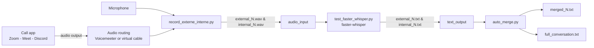

# Project 1 — Call Recording (Internal + External) + Whisper Transcription

Project 1 is the first step of a larger roadmap to build an application that can analyze calls and coach the caller (success indicators, mistakes, suggested next actions, etc.).

This repo focuses on a **solid local pipeline** that:

- **Records both audio sources** during a call on a computer  
  - **External**: your microphone (what the company/caller says)  
  - **Internal**: computer/call audio (what the client says, i.e., whatever you hear from Zoom/Google Meet/Discord/etc.)
- **Transcribes each recording locally** (no API) using **Whisper via `faster-whisper`**
- **Outputs readable transcripts** with timestamps, plus an **auto-merged “conversation view”**

---

## What’s in this repository

### Main Project 1 pipeline (Whisper, file-based)

1. **Recorder** (`record_externe_interne.py`)  - (Ibtissam) <br/>
   Records the microphone and the internal/system audio in parallel, as WAV chunks (`10s` segments by default).

2. **Transcriber** (`test_faster_whisper.py`) - (Lazar)<br/>
   Watches the `audio_input/` folder and transcribes each new audio chunk using `faster-whisper` (default: `large-v3` on GPU).

3. **Auto-merger** (`auto_merge.py`) - (Lazar)<br/>
   Watches the `text_output/` folder and merges internal/external transcripts for each segment into:
   - `text_output/merged_<N>.txt`
   - `full_conversation.txt` (appended)

4. **UI** (`ui.py`) - (tafsouth)<br/>
   Watches the `text_output/` folder and displays it in a live UI that updates every time a new transcription is added
  

---

## Architecture (Project 1)



### Techniques used

- **Dual-source audio capture** using `sounddevice` (PortAudio)
- **Chunked recording** (fixed segment duration, e.g. 10 seconds) to simplify streaming-like processing
- **Folder-watching pipeline** (simple local queue): scripts poll `audio_input/` and `text_output/` every second
- **Local ASR (speech-to-text)** using `faster-whisper` (CTranslate2) with timestamps
- **Timestamp-based merge** to reconstruct who said what, per segment

---


## Requirements

### OS (recommended)
- **Windows** is the easiest path for “internal audio” capture (because this project is currently configured with a Voicemeeter/WASAPI input device).
- Other OSes are possible, but you must provide an **input device** that represents system audio (e.g., BlackHole on macOS, PulseAudio monitor sources on Linux).

### Hardware (recommended)
- NVIDIA GPU strongly recommended if you want fast transcription with `large-v3`.
- CPU-only is possible but will be much slower.

### Software
- Python (tested with 3.10+; scripts are plain Python)
- (Optional) Node.js + npm (only for `realtime_transcribe/frontend`)
- Audio routing tool for internal audio capture (examples):
  - Voicemeeter (Windows), VB-Audio cable, etc.

---

## Setup

### 1) Clone and create a virtual environment

```bash
git clone <your-repo-url>
cd WhisperForg

python -m venv .venv
# Windows:
.venv\Scripts\activate
# macOS/Linux:
source .venv/bin/activate
```

### 2) Install Python dependencies (Project 1)

At minimum:

```bash
pip install numpy sounddevice soundfile faster-whisper
```

#### GPU setup (recommended)

If you have an NVIDIA GPU, install PyTorch with CUDA support first, then `faster-whisper`.

Example (CUDA 12.1 runtime wheels):

```bash
pip install torch torchvision torchaudio --index-url https://download.pytorch.org/whl/cu121
pip install faster-whisper
```

Quick GPU sanity check:

```bash
python -c "import torch; print('CUDA available:', torch.cuda.is_available()); print('GPU:', torch.cuda.get_device_name(0) if torch.cuda.is_available() else None)"
```

---

## Configure audio devices (very important)

`record_externe_interne.py` uses **device indexes**:

```py
DEVICE_EXTERNE = 1   # external mic
DEVICE_INTERNE = 15  # internal/system audio (e.g., Voicemeeter Out B1 WASAPI)
```

### Find your input device indexes

Run this in Python to list devices:

```bash
python -c "import sounddevice as sd; print(sd.query_devices())"
```

Then set `DEVICE_EXTERNE` and `DEVICE_INTERNE` to the correct **input-capable** devices.

### Internal audio (system/call audio)

To record “what you hear” (client audio), you typically need a virtual/loopback input:

- **Windows (typical)**:  Voicemeeter(version banana) + a bus output exposed as a WASAPI input (e.g., “Voicemeeter Out B1”)
- Ensure your call app output (Zoom/Meet/Discord) is routed into that bus/output.

If internal audio is silent, it usually means the call audio is **not routed** to the virtual device you’re recording.

---

## Run the Project 1 pipeline (3 terminals)

> All scripts assume you run them from the `WhisperForg/` directory so paths like `audio_input/` resolve correctly.

### Terminal 1 — Start recording (creates WAV chunks)

```bash
python record_externe_interne.py
```

- Records segments of `SEGMENT_DURATION` seconds (default: 10s)
- Writes:
  - `audio_input/external_<N>.wav`
  - `audio_input/internal_<N>.wav`

Stop with `Ctrl + C`.

### Terminal 2 — Start transcription (Watches `audio_input/`)

```bash
python test_faster_whisper.py
```

- Loads Whisper model:

  ```py
  model = WhisperModel("large-v3", device="cuda", compute_type="float16")
  ```

- For every new audio file in `audio_input/`, writes a transcript to `text_output/`:
  - `text_output/external_<N>.txt`
  - `text_output/internal_<N>.txt`

Each transcript contains timestamped segments like:

```
[0.00s → 2.50s] Hello there
```

### Terminal 3 — Start auto-merge (Watches `text_output/`)

```bash
python auto_merge.py
```

When both `internal_<N>.txt` and `external_<N>.txt` exist, it generates:

- `text_output/merged_<N>.txt`
- Appends to `full_conversation.txt`

Merged lines are labeled (this is **just a mapping**, you can swap it):

- `COMPANY` = transcript coming from `internal_<N>.txt`
- `CLIENT`  = transcript coming from `external_<N>.txt`

> In `record_externe_interne.py`, the default comments suggest **external = microphone** and **internal = system/call audio**.  
> If that matches your setup, you will probably want **external → COMPANY** and **internal → CLIENT** (swap the labels in `auto_merge.py`).

---

## Outputs and how to read them

### Audio chunks
- `audio_input/external_<N>.wav`
- `audio_input/internal_<N>.wav`

### Raw transcripts
- `text_output/external_<N>.txt`
- `text_output/internal_<N>.txt`

### Merged conversation view
- `text_output/merged_<N>.txt` (per 10-second segment)
- `full_conversation.txt` (appends segments in the order they are merged)

⚠️ **Current behavior:** timestamps reset to `0.00s` for each segment because each WAV chunk is transcribed independently. This is perfect for segment-level testing, and can be upgraded later to “global timestamps” by adding an offset (`segment_index * SEGMENT_DURATION`) during merge. (We still did not implement this)

---

## Troubleshooting

### “I get the wrong audio / nothing is recorded”
- Re-check `DEVICE_EXTERNE` and `DEVICE_INTERNE` in `record_externe_interne.py`.
- List devices again:

  ```bash
  python -c "import sounddevice as sd; print(sd.query_devices())"
  ```

- Make sure the chosen devices have `max_input_channels > 0` (input-capable).

### Internal audio is silent
- Your call app (Zoom/Meet/Discord) must output to the same virtual device/bus you are recording.
- Verify the virtual/loopback device is configured as an *input* for recording.

### Whisper is slow on CPUs
- `large-v3` is heavy. On CPU it can be very slow.
- If you have an NVIDIA GPU, verify:

  ```bash
  nvidia-smi
  python -c "import torch; print(torch.cuda.is_available())"
  ```

### Auto-merge doesn’t create merged files
- Ensure both transcript files exist with matching numbering:
  - `text_output/internal_<N>.txt`
  - `text_output/external_<N>.txt`

---

## Current limitations (normal for Project 1)

- Segment-by-segment (chunked) processing, not “true streaming” Whisper yet
- Timestamps are per-chunk, not global across the entire call
- “UI” for Project 1 is currently the generated text files (plus the optional `realtime_transcribe/` demo)
- Speaker labeling is fixed (COMPANY vs CLIENT) and depends on your routing

---

## Roadmap (next steps after Project 1)

- Global timeline alignment (per-call timestamps)
- Better audio sync (avoid drift between devices)
- Voice Activity Detection (VAD) and smarter chunking
- Near-real-time Whisper streaming + coaching layer (LLM-based call guidance, compliance, objection handling, etc.)

---

## Credits

Built with:

- `sounddevice` / PortAudio for capturing audio
- `soundfile` for writing WAV files
- `faster-whisper` (CTranslate2) for local Whisper transcription

